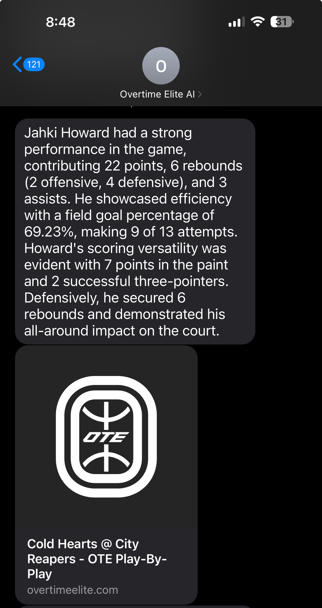

## Description

A server-side application buit with
[NestJS](https://github.com/nestjs/nest) which performs the following actions:

1. A user can sign up for updates about their favorite players using an SMS interface designed with Twilio studio. "Light" AI is used to understand semantic intent like when a user might respond "yes", "ya", or "yeah" to indicate affirmation. However, where possible, answers to questions like favorite player or favorite team are assigned a number to prevent misspellings.

2. Every few minutes, the service polls a public endpoint that lists completed games to see if there has been a new addition to the list. If yes, that game is added to a queue to be processed. This allows us to not add multiple games for processing, and to retry the same game more than once should something go wrong. 

3. From the completed game, a separate endpoint is queried to retrieve all players that have played in a game. Once all players have been retrieved and queued for processing, the *game itself* is considered to have been processed. The players queue simply functions as a FIFO queue and deletes records from the collection once a player has been processed.

4. An instance of ChatGPT is initialized and given the role of basketball coach / analyst, and a JSON shape representing the player's completed game is passed in via API. 

**Note:** *The initial implementation of this POC was serverless, so workers are spun up to push as many objects into ChatGPT as ChatGPT will allow. Also, to prevent the serverless function(s) from timing out, the workers pass instructions back-and-forth to keep each other alive. This implementation was intended to remove this behavior since a server-side application wouldn't face the timeout issue.*

5. The users table is qeuried, and a new record is put together and added to a new collection with the game summary and an array of phone numbers to which to text the performance to along with a link to that game's box score. 

6. Twilio is used once again to facilitate the sending of the message. The final output looks like this:




## Installation

```bash
$ npm install
```

## Running the app

```bash
# development
$ npm run start

# watch mode
$ npm run start:dev

# production mode
$ npm run start:prod
```

## Test

```bash
# unit tests
$ npm run test

# e2e tests
$ npm run test:e2e

# test coverage
$ npm run test:cov
```